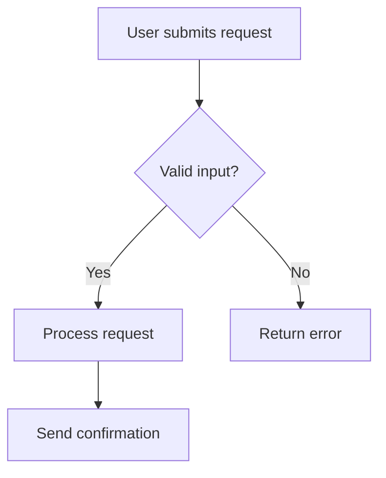

# Lucid MCP — Research Findings

## Overview

The **Lucid MCP server** is a remote HTTP service that exposes Lucid's diagramming capabilities to any MCP-compatible AI client. It uses OAuth 2.0 for authentication and the streamable HTTP transport protocol.

**MCP server URL:** `https://mcp.lucid.app/mcp`

---

## Authentication

### How it works

- Uses **OAuth 2.0** with Dynamic Client Registration (DCR)
- First connection opens a browser tab for the user to authorize
- Credentials are cached locally after first auth — subsequent runs are silent
- Two auth steps required:
  1. Server authentication (register Lucid MCP as a trusted service)
  2. Permission scope approval (grant access to user documents and data)

### Connecting from Python (via mcp-remote)

Since the Lucid MCP server is HTTP-only, Python MCP clients that only support stdio need a bridge. The `mcp-remote` npm package provides this:

```bash
npx -y mcp-remote https://mcp.lucid.app/mcp
```

This spawns a local process that handles the OAuth flow and proxies MCP calls over stdio.

### JSON config for AI tools

**HTTP transport (preferred if supported):**

```json
{
  "Lucid Software": {
    "type": "http",
    "url": "https://mcp.lucid.app/mcp"
  }
}
```

**Stdio via mcp-remote (for tools without HTTP transport):**

```json
{
  "Lucid Software": {
    "command": "npx",
    "args": ["-y", "mcp-remote", "https://mcp.lucid.app/mcp"]
  }
}
```

### Using in the Copilot SDK (Python)

The GitHub Copilot SDK supports MCP servers natively via `mcp_servers` in `SessionConfig`:

```python
session = await client.create_session({
    "mcp_servers": {
        "lucid": {
            "type": "local",       # local = stdio subprocess
            "command": "npx",
            "args": ["-y", "mcp-remote", "https://mcp.lucid.app/mcp"],
            "tools": ["*"],        # expose all Lucid MCP tools to the agent
        }
    }
})
```

The SDK then makes all discovered Lucid MCP tools available to the LLM automatically — no manual tool wrapping required.

---

## Available Actions (Capabilities)

| Capability                        | Example Prompt                                                     |
| --------------------------------- | ------------------------------------------------------------------ |
| Search documents                  | "Show me all Lucid documents about the website redesign."          |
| Summarize document                | "Find the 'Q4 Roadmap' doc and give me a summary."                 |
| **Create a diagram**              | "Create a user authentication flow diagram in Lucid."              |
| Create from description           | "Build a process diagram for a customer refund request."           |
| Create from data                  | "Create a sequence diagram from this dataset."                     |
| Create org chart                  | "Use this employee list to create an org chart in Lucid."          |
| Edit shapes                       | "Update all decision blocks in my IT Escalation doc to red."       |
| **Generate UML sequence diagram** | "Create a UML sequence diagram using this PlantUML syntax."        |
| Create shareable link             | "Create a view-only shareable link for my 'Project Proposal' doc." |
| Share with collaborator           | "Share my flowchart with jane@example.com with edit permissions."  |
| Export as PNG                     | "Export my 'Project Timeline' document as a PNG."                  |
| Fetch image                       | "Fetch the source image from 'Feature A Screenshot' in my doc."    |

---

## Diagram Types Supported

The Lucid MCP server can generate any diagram type Lucidchart supports:

- **Process flow / flowcharts**
- **Sequence diagrams** (including from PlantUML syntax)
- **Entity-relationship diagrams (ERDs)**
- **Org charts** (from CSV or text with employee data)
- Any other Lucidchart-native diagram type

> Note: Diagrams created are static — they do not auto-update when source data changes.

---

## How Diagram Creation Works

When the agent calls a Lucid MCP tool to create a diagram:

1. The tool receives a natural language description or structured data
2. Lucid's server interprets it and creates a new Lucidchart document
3. The tool returns a **clickable Lucidchart URL** pointing to the created document
4. The agent surfaces this URL in the chat

For iteration, the agent can:

- Retrieve the document ID from the previously returned URL
- Call update tools to modify existing shapes/connectors
- Return the same URL (the document updates in place)

---

## Key MCP Tools (Discovered at Runtime)

The exact tool names are discovered dynamically when the MCP session initializes. Based on Lucid documentation, expect tools in these categories:

| Category            | Tools                                                                                          |
| ------------------- | ---------------------------------------------------------------------------------------------- |
| Document management | `search_documents`, `get_document`, `create_share_link`                                        |
| Diagram creation    | `create_document`, `create_diagram` (natural language), `generate_sequence_diagram` (PlantUML) |
| Shape editing       | `add_shape`, `update_shape`, `delete_shape`                                                    |
| Connector editing   | `add_line`, `update_line`                                                                      |
| Collaboration       | `share_document`                                                                               |
| Export              | `export_document`                                                                              |

> To see actual tool names: connect to the MCP server and call `list_tools()`.

---

## Fallback Strategy

If the Lucid MCP server is unavailable or authentication fails:

- The agent falls back to rendering diagrams as **Mermaid syntax** in the chat
- Mermaid supports flowcharts, sequence diagrams, and ERDs natively
- Example fallback output:



---

## Admin Controls

Lucid account admins (Team/Enterprise) can enable or disable MCP access:

1. Admin panel → Security → Feature controls → "MCP access"
2. Toggle "Allow users to connect"

---

## Resources

- [Lucid MCP Help Article](https://help.lucid.co/hc/en-us/articles/42578801807508)
- [Lucid Community: Introducing the MCP Server](https://community.lucid.co/community-news-and-announcements-9/introducing-the-lucid-model-context-protocol-mcp-server-12230)
- [MCP Protocol Docs](https://modelcontextprotocol.io/docs/getting-started/intro)
- [mcp-remote npm package](https://www.npmjs.com/package/mcp-remote)
